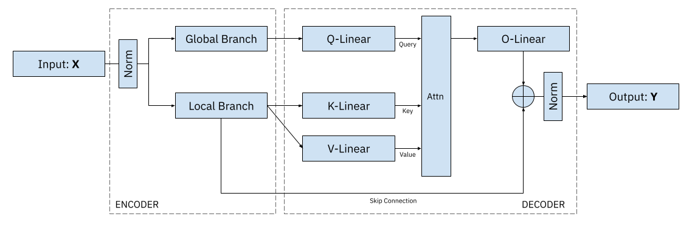

# The TorontoBikeProblem (TBP)

🚲 **Bike Utilization Prediction in Toronto** 🚀

Welcome to the repository for the "Bike Utilization Prediction" challenge hosted by Bosch in collaboration with the "Bundeswettbewerb KI"!

👥 Our talented team, consisting of Alexander, Katharina, Max, Bileam, and Paul, is determined to tackle this exciting challenge using the power of AI.

The goal of this project is to develop a robust model that predicts the utilization of bikes in the vibrant city of Toronto. By leveraging advanced data analysis and machine learning techniques, we aim to optimize urban mobility and encourage eco-friendly transportation options.

Join us in revolutionizing how people move around the city! Together, we can make a positive impact on urban transportation. 🌆🌍

Feel free to explore our repository and contribute to our innovative solution! 🚀

## Theory

TODO (:>)~

## Quickstart
TODO (:>)~

## Training
TODO (:>)~

## Evaluation
TODO (:>)~
